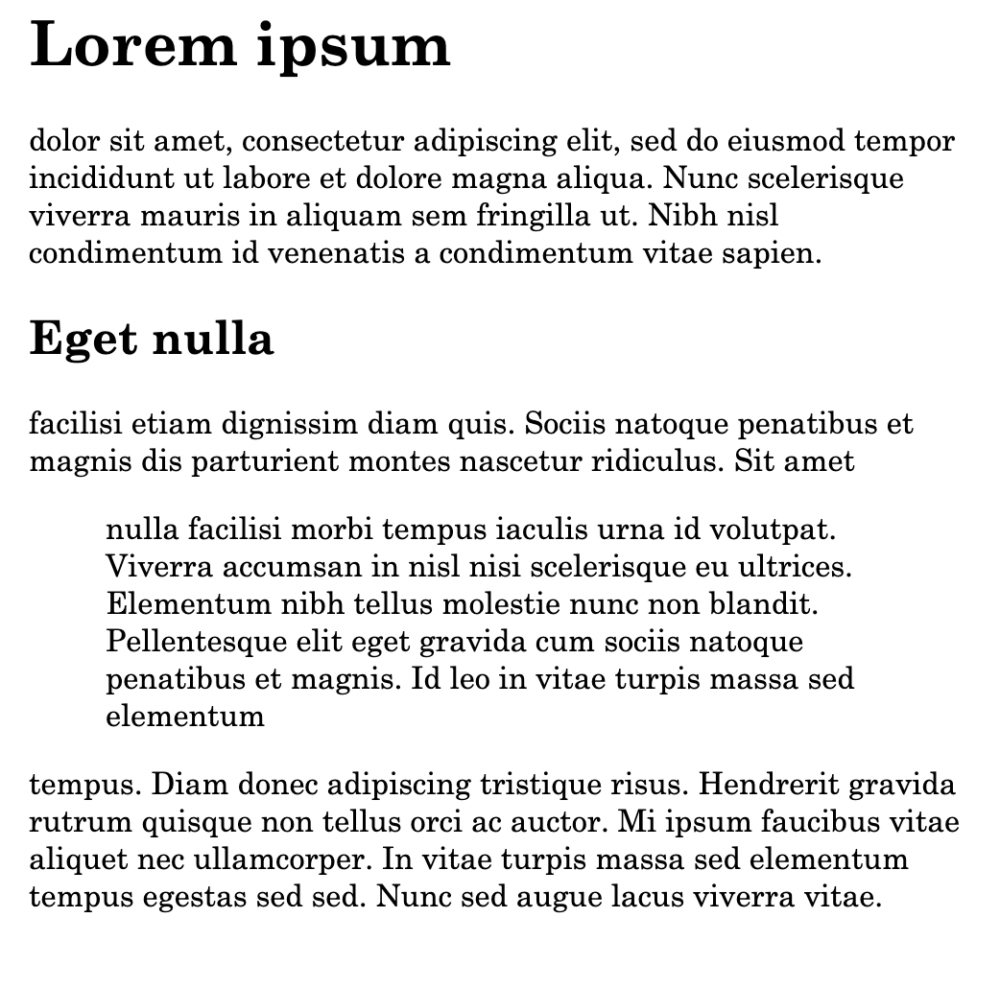
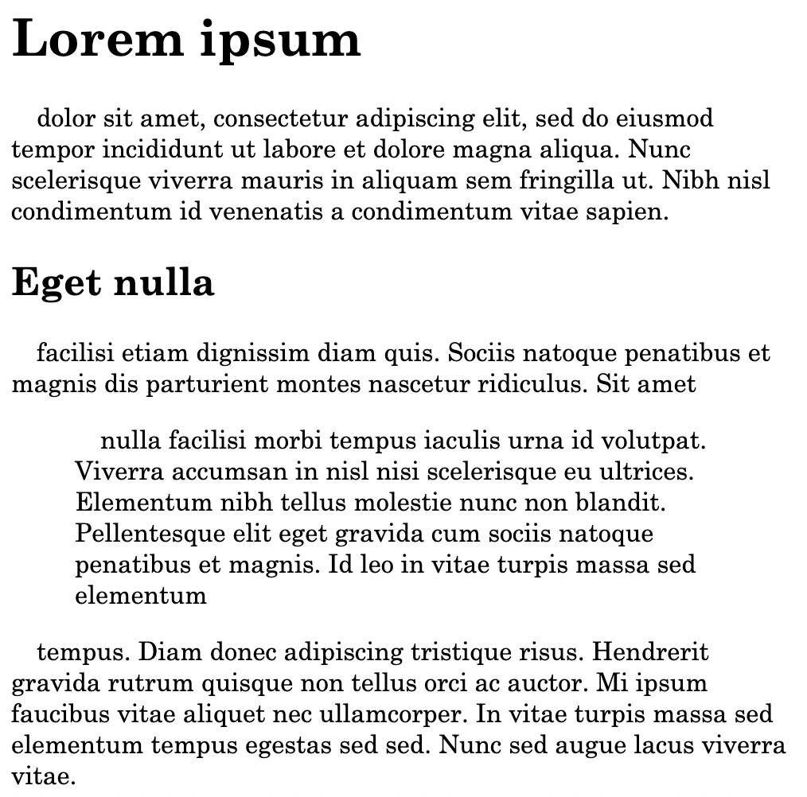

<link rel="stylesheet" href="styles.css">

## Why would you care about CSS?

CSS stands for Cascading Style Sheets. It is a text format that allows you to describe the visual appearance of HTML documents. In DEVONthink, CSS is used to determine the visual appearance of Markdown documents when they are rendered as HTML. Whenever you select the **display** (?) mode to look at a Markdown document, you'll see it rendered as HTML in some kind of "style". Unless you do anything about it, this will be the style that is built into DEVONthink (and the HTML engine it uses). If you're happy with that, you can stop reading here.

## How can you tell DEVONthink to use your own CSS?

As of the time of this writing (DEVONthink Pro Version 3.8 and DEVONthink To Go 3.5.1), there are four methods to specify your own CSS in DEVONthink:

1. In the global preferences. In DEVONthink, you'd provide the x-devonthink-item URL to a record stored somewhere in your database(s) and containing your CSS. In DEVONthink To Go, you do the same in the settings for Markdown documents. A globally defined CSS will influence _all_ Markdown documents in DEVONthink.

2. Add  `css: URL` as the first line of your Markdown document(s). The `URL` can be any valid URL as well as an `x-devonthink-item://...` one or an absolute address of a record containing your CSS definitions like `/Inbox/myCss.txt`.

3. Add a HTML `script` element somewhere in your Markdown document, i.e. a piece of code looking like that
 `<style>  Style definitions go here</style>` If you go for this option, make sure that you _do not_ have any empty lines in the `style` element. Those will break everything.

4. Add a HTML `link` element to the top of your Markdown document like so `<link rel="steylsheet" href="URL">` Again, the `URL` parameter can be anything from a usual URL to a `x-devonthink-item://...` one or an absolute location like `/Inbox/myCSS.txt`.

The last three methods will add CSS only to those Markdown documents where you insert them. So they're not really useful if you want to make sure that _all_ your Markdown documents look the same.

## What does CSS look like?

A style sheet is a sequence of definitions of the form
```css
selector: {
  attribute1: value1;
  attribute2: value2;
  ...
}
```
where `selector` specifies the HTML elements to which the following definitions are applied. Note that there _must_ be a colon between the attribute and its value, and that there _must_ be a semicolon after the value.

All that selector and attribute stuff might sound overly complicated, so let's consider a simple example:
```css
body {
  color: black;
  background-color: white;
}
```


These lines make sure that the `body` element of an HTML document is displayed black (`color`) on white (`background-color`). As styles are "cascading" (the C in CSS), this simple definition ensures that _all text__ in your rendered Markdown appears black on white – all elements are children of the `body` element and by default inherit its style definitions.

So what would you do if you wanted to make quotes appear indented and with a different background color? You'd have to define these attributes for the element `blockquote`:
```css
blockquote {
  background-color: lightgrey;
  margin-left: 2em;
}
```
The `background-color` should be obvious. `left-margin` defines the distance of the left edge of the element from the left edge of its parent element. So here, this distance is `2em`, which means "two em spaces". An em space is a typographical unit that is as wide as the font's height.

### Refrain from absolute units!

In many CSS examples, you'll still find units like `px`, for example something like  `margin-left: 10px`. While it might be tempting to use these absolute units, you should in most cases _not_ do that. Instead, employ relative units like `em` or `%` or `ch` (number of characters) or `vw` (percentage of the viewport width). These allow for a "responsive" layout, i.e. one that works well with different screen sizes and orientations. Pixel sizes vary widely from one device to the next and do not work well if the user zooms in or out.

Note that `%` values always refer to the enclosing element's (i.e. the parent's) dimensions. In the case of `font-size`, a percentage value also refers to the font size of the parent element.

You might have wondered where the `blockquote` element came from in the second
example above. There is a fairly simple relationship between Markdown markers
and HTML elements as shown in the following table. Click on the ▶︎ to
open it. 

<details>
<summary>Relationship between Markdown and HTML elements</summary>

| Markdown | HTML element |
| :---- | :----- |
| Newline separated text | `<p>text</p>`|
| # | `<h1>...</h1>` |
| ## | `<h2>...</h2>` |
| ### | `<h3>...</h3>` |
| and so on until ######| `<h6>...</h6>` |
| - | `<li>` as children of an `<ul>`, content of the `li` is wrapped in `p` elements.  |
| 1.| `<li>` as children of an `<ol>`, content of the `li` is wrapped in `p` elements.  |
| > | `<blockquote>...</blockquote>`, content wrapped in `p`elements. |
|  \[text](URL) |  `<a href="URL">text</a>`|
| !\[text](URL) | ``|
| \|...\|| `<table>...</table>` with all appropriate child elements |
</details>

## Debugging CSS and playing with It

While it is possible to change an external CSS, switch the view in DEVONthink and then go back editing the CSS until the results please you, that is a bit tedious. A simpler approach is this:
- convert your Markdown document to HTML in DEVONthink
- open this new HTML document your favorite browser
- right click somewhere in the document and select "Inspect element".

That will open the developer tools of your browser (you might have to enable developer mode in Safari first, though). There, you'll find a "style" tab in which you can easily modify the styles for all elements individually or change the definitions in your CSS and see the changes immediately in HTML.

## Delving deeper into CSS

CSS is a complicated beast, and it's getting more so every day (no thanks to Google inventing and implementing new exciting stuff). The only authoritative documentation is the one at the [W3C](https://w3c.org). However, that's unwieldy stuff not meant for mere mortals. There are numerous websites out there providing easier to digest examples and reference material, notably [CSS tricks](https://css-tricks.com/) and the [Mozilla Developer Network](https://developer.mozilla.org/docs/Web/CSS/).

### Structure of HTML generated from Markdown

The good news is that the HTML generated from Markdown is fairly simple. It contains only HTML elements without any classes or IDs. Also, the number of elements is quite small, so you won't see the fancier stuff like `aside`, `nav`, `section` and the like, nor any `div`s wrapping elements. Basically, a HTML document generated from Markdown, has this structure:
```html
<head>....</head>
<body>
  <h1>...</h1>
  <p>...</p>
  <h2>...</h2>
  <p>...</p>
  <blockquote><p>...</p><p>...</p</blockquote>
  other elements
</body>
```
where other elements can be lists or tables. All elements except `head` and `body` can repeat any number of times. Links and images are just rendered as shown above inside a `p` element. This simple structure makes styling HTML generated from Markdown quite easy, at least compared to a full-fledged HTML document.

### Lay out the foundation

To start from scratch, I suggest to set all relevant values to reasonable defaults on the `body` element. This is sometimes referred to as a _CSS reset_. Of course, it is up to you what you consider "reasonable". Something like this might be a starting point:
```css
body {
  margin-left: 2em;
  font-family: "Century Schoolbook", Times, serif;
  font-size: 1em;
  color: black;
  background-color: white;
  padding: 0;
  max-width: 55ch;
}
```
The choice of the `font-family` is very much a matter of taste (more so then everything else, probably). Here, I went for a serif font: "Century Schoolbook" is used if it's available. Otherwise,  "Times", and if that's also missing, the default serif font. Also, I specified a `font-size` of `1em`, which is exactly the same as the font size specified for the user agent (aka "browser") used to render the HTML. This is not strictly necessary, but it makes sure that the default text size in your HTML is the same the user specified in their browser settings.

To make the text easier to read, the maximum width of the `body` element (and all its children!) is set to `55ch`, that is 55 average characters (loosely speaking). `padding` is the inner margin of an element that will remain blank, whereas `margin` is the space between the current element and its parent. Here, I specify a left margin of  `2em` so that the text does start flush left.

### Fine-tune HTML elements

These styles for `body` define a baseline. Now you can specify differing styles for other elements to your heart's content. For example, if you'd like the first line of every paragraph to be indented by an em space, you could use

```css
p {
  text-indent: 1em;
}
```

or if you'd want all first level headlines to have a red underline
```css
h1 {
  text-decoration: underline red;
}
```

or if you'd want all third level headings to appear in uppercase

```css
h2 {
  text-transform: uppercase;
}
```

The latter, though, is probably not a very good idea – firstly, all uppercase letters are more difficult to read, secondly many readers will think that you're screaming at them. And thirdly, the text looks fundamentally different than what you see in your Markdown document.

## Styling block quotes

You've already seen a short example that made quotes stand out from the regular text. Another, more advance one is this:
```css
blockquote {
  margin-left: 2em;
  border-left: 1px red solid;
  background-color: lightgrey;
}
```

Now, if you look at that in the rendered view, you might think that it leaves room for improvement. And it certainly does: first, the background color starts at the left side of the block, but the text begins `2em`s to the right of that. It would be nicer if only the text would have a different background color, not the whole block including the margin.

Then the first line of text is indented by `1em`. That happens because it is contained in a `p` element, and all `p` elements are indented. But we don't want that for those paragraphs inside a `blockquote`:
```css
blockquote > p {
  text-indent:0
}
```
Here, `blockquote > p` selects only those paragraphs that are immediate children of a `blockquote` element, and `text-indent: 0` resets the indentation of their first line so they're flush left. Now you can use the same selector to change the background: Remove the setting for `background-color` from the `blockquote` style and add it to the style for the blockquote's paragraph children like this
```css
	margin-left: 1em;
	background-color: lightgrey;
```


That gives you a white margin of `1em` between the red vertical bar at the left and the grey background of the blockquote.

## What about fonts?

If you want different fonts in your running text and your headline, you have to specify a different `font-family` for the headlines:
```css
h1, h2, h3, h4 {
  font-family: Avenir, Helvetica, "sans serif"
}
```

This `font-family` applies to  headlines level 1 through 4. Note that font names containing spaces must be enclosed in double quotes.  The selector is an example for specifying the same style for several HTML elements: just list the elements (or even more complicated selectors like `blockquote > p`) separated by commas.

Usually, the default font sizes for the different headings are ok. If you want to change those, use the attribute `font-size` and specify an `em` value, for example `2.0em` for a `h1`. Do not use pixels or other absolute values here: The person viewing your HTML might have chosen their own preferred font size in the browser settings and specifying absolute values for font sizes plays havoc with these settings.

Other font attributes you might want to use are `font-weight` to specify `light` or `bold` variants, `text-decoration` and `text-transform`.

## What about colors?

The preceding samples used named colors. While that might seem natural (at least for English speaking people), it is a bit awkward. What if you want a particular type of light green with a blue tint? It would be a challenge to even come up with a single english word to describe that color. And you couldn't be sure that your browser (or any browser) understands what you mean. Therefore, you can also specify colors by three hexadecimal digits like `#fff` (for white) or `#f00` (for a dark red) or by six of them (`#ffffff` or `#ff0000`). These values represent values for red, green and blue components. So instead of going with the `lightgrey` understood by browsers, you might want to use `#eee` which is more a dirty white.

Other ways to specify colors are using `rgb(red, green, blue)` where the values in parenthesis are numbers between 0 and 255 or `hsl(hue, lightness, saturation)`. [MDN describes these variants in an article on `color` values.](https://developer.mozilla.org/de/docs/Web/CSS/color_value)

## How to center elements

Sometimes you might want to center certain elements, for example tables. Firstly, in many cases that only makes sense if the element is not as wide as the surrounding ones. So you should set a `width` value for your element that is smaller then the `body`'s width. After that, simply set both `margin-left` and `margin-right` to `auto`. That makes sure that both margins are equally wide and that the white space is evenly distributed to the left and right of your element – effectively centering it. For a table, you'd for example write
```css
table {
  width: 45ch;
  margin-left: auto;
  margin-right: auto;
}
```
## Sizing and styling images

Without styling, an image will be displayed as large as possible. If it is
smaller than the enclosing element (i.e. `body`), it will be made as wide as the
`body` element is. If it's smaller, it will be displayed in its original size.


The image height will be set to respect the original aspect ration and avoid distortion. There are ways to specify image width and height in the Markdown document itself, but I'd advise against it: It is a lot easier to style (and size) all images the same way with CSS. So,

```css
img {
  width: 50%;
}
```
sets the width of all images to half of their parent element.


If you try that out, you'll notice that an image in the middle of a paragraph looks a bit weird since it interrupts the flow of the text in a funny way.

The reason for that is that an `img` element is rendered "inline", like text. Since it takes up a lot more vertical space than a line of text, the text flow is interrupted.

One way to remedy this is make sure images are rendered differently:
```
img {
  display: block;
}
```

That makes sure that images behave like paragraphs, i.e. they force line breaks before and after them.

Another, more visually pleasing way to style images is to make text flow around them as described below.

You might want to add a small shadow at the right and bottom margins of the image to make it stand out slightly:
```
img {
  box-shadow: 0.3em 0.3em 0.3em #ddd;
}
```
does just that. Explaining the values in detail would take up too much space here, though. You might want to read about `box-shadow` over at MDN and play around with the parameters.

### Flowing text around images

In many  cases, it looks nicer if the text continues next to the image instead of having a wide blank area around the image. You can achieve this by "floating" the image:
```css
img {
  float: left;
}
```

makes the image stay at the left margin of the document, while the text
continues at its right side. You should set the top, right, and bottom margin
for the `img` element, too, so that the text does not crowd it.


Instead of having the text flow around the image at the right side, you can set `float` to `right` so that the image appears at the document's right margin and the text to the left of it.

## Styling tables

Styling tables is more demanding then styling other elements. You first have to understand table structure: a `table` element consists of a head and a body (`thead` and `tbody`). Both of them in turn are made up of row (`tr`) elements. And every row consists of `th` (for a table head) or `td` elements which are finally defining the table cells themselves. So the whole thing looks like that:
```html
<table>
  <thead>
  <tr><th>...</th><th>...</th>...</tr>
  </thead>
  <tbody>
  <tr><td>...</td><td>...</td>...</tr>
  <tr><td>...</td><td>...</td>...</tr>
  ...
  </tbody>
</table>
```
You've just seen how to apply a very basic styling (i.e. centering) to the whole table. One detail many people want are lines dividing the columns and rows. That, however, is not something you can set for the whole table. Instead, you have to specify a `border` for the `td` and `th` cells (i.e. those in the body and the head of the table):

```css
table :is(td, th) {
  border: 1px solid black;
  padding: 0.3em;
}
```
Here,  `table :is(td.th)` is an abbreviation for `table td, table th`. The border is defined as being one pixel wide, using a solid black line. This is one of the few exceptions where a pixel dimension is ok – you just want a fine line around the cells, it doesn't really matter how big a pixel is. The `padding` makes sure that the text in the cells has some space to breath.

However, these settings will result in a peculiar phenomenon in that there's small white space now between the borders of the individual cells. They look a bit like windows in a building. To get rid of it, add `border-collapse: collapse` to the style of the `table` element.

Another often required feature are alternating row colors. They're fairly easy to achieve like this:

```css
tr:nth-child(even) {
  background-color: lightblue;
}
```

This will display every second row with a light blue background, starting with the second row. If you want to start it with the first row, use `even` instead of `odd` in the above selector. If you want different colors for every second row, combine these rules like so:

```css
tr:nth-children(even) {
  background-color: lightblue;
}
tr:nth-children(odd) {
  background-color: lightgreen;
}
```

`:nth-children` is a "pseudo-selector", and there are a lot of them, so it's worth checking them out on MDN.  Instead of `even` or `odd` you can specify more complicated rules like `4n+1` to select the rows 1, 5, 9, 13 etc. In fact, `even` is the same as `2n` and odd is `2n+1`.

## What about dark mode?

Until now, all examples were assuming the document were displayed as dark text on a white background. That would look weird on a device set to dark mode, where text should be light on a dark background.

You can detect the mode in your CSS with a "media selector" like so:
```css
@media (prefers-color-scheme:dark) {
... style definitions go here
}
```
The simplest style definition for dark mode would be something like
```css
body {
  background-color: black;
  color: white;
}
```
and you have to make sure to put this _inside_ the curly braces following the media selector.

This is just the most basic setting. If you use different colors, you verify  that they display nicely in dark mode. And if you're using borders, you might want to make them wider in dark mode since light on dark is more difficult to see than dark on white. Also, a font with very fine character stems might not be a good idea for dark mode, since these stems are harder to recognize.

