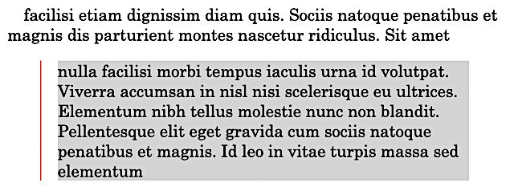
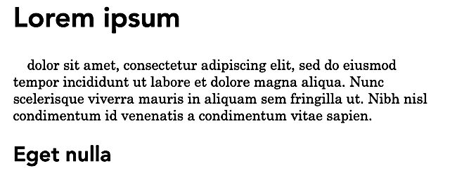
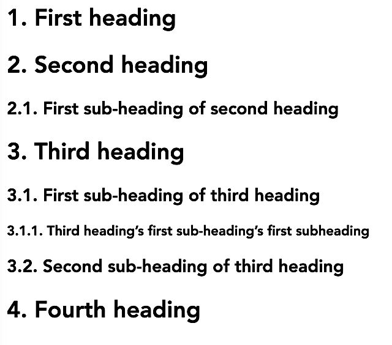

<link rel="stylesheet" href="styles.css">
{{TOC}}
## Why would you care about CSS?

CSS stands for Cascading Style Sheets. It is a text format that allows you to describe the visual appearance of HTML documents. In DEVONthink, CSS is used to determine the visual appearance of Markdown documents when they are rendered as HTML. Whenever you select the preview mode to look at a Markdown document, you'll see it rendered as HTML in some kind of "style". Unless you do anything about it, this will be the style that is built into DEVONthink (and the HTML engine it uses). If you're happy with that, you can stop reading here.
## How can you tell DEVONthink to use your own CSS?
As of the time of this writing (DEVONthink Pro Version 3.8 and DEVONthink To Go 3.5.1), there are four methods to specify your own CSS in DEVONthink:

1. In the global preferences. In DEVONthink, you'd provide the x-devonthink-item URL to a record stored somewhere in your database(s) and containing your CSS. In DEVONthink To Go, you do the same in the settings for Markdown documents. A globally defined CSS will influence _all_ Markdown documents in DEVONthink.

2. Add `css: URL` as the first line of your Markdown document(s). The `URL` can be any valid URL like `x-devonthink-item://...`, the absolute address of a DT record containing your CSS definitions like `/Inbox/myCss.txt`, or a relative address like `styles.css`.

3. Add a HTML `style` element somewhere in your Markdown document, i.e. a piece of code looking like that
   `<style> Style definitions go here</style>` If you go for this option, make sure that you _do not_ have any empty lines in the `style` element. Those will break everything.

4. Add an HTML `link` element to the top of your Markdown document like so `<link rel="stylesheet" href="URL">` Again, the `URL` parameter can be anything from a usual URL to a `x-devonthink-item://...` one or an absolute location like `/Inbox/myCSS.txt`.

The last three methods will add CSS only to those Markdown documents where you insert them. So, they're not really useful if you want to make sure that _all_ your Markdown documents look the same.

**Caveats** All four methods work just fine _inside_ DT. That is, if you look at the preview of your Markdown document in DT, you'll see all styles applied. Similarly, if you convert it to HTML or PDF inside DT, the styles will be reflected in those new documents. However, as soon as you're trying to work with a Markdown document outside of DT (or display the HTML in a browser), you have make sure that the other application can find your style sheet. Which it _can_ do if you are
- using a URL to a location accessible via HTTP, like `https://example.com/styles.css`, or
- including all styles verbatim in a `style` element _in_ the Markdown document 
  
However, neither an `x-devonthink-item` URL nor a record located in one of your databases will work as CSS definition in a browser or any other application. 
## What does CSS look like?
A style sheet is a sequence of definitions of the form
```css
selector: {
  attribute1: value1;
  attribute2: value2;
  ...;
}
```
where `selector` specifies the HTML elements to which the following definitions are applied. Note that there _must_ be a colon between the attribute and its value, and that there _must_ be a semicolon after the value.

All that selector and attribute stuff might sound overly complicated, so let's consider a simple example:
```css
body {
  color: black;
  background-color: white;
}
```


These lines ensure that the `body` element of an HTML document is displayed black (`color`) on white (`background-color`). As styles are "cascading" (the C in CSS), this simple definition ensures that _all text_ in your rendered Markdown appears black on white – all elements are children of the `body` element and by default inherit its style definitions.

So, what would you do if you wanted to make quotes appear indented and with a different background color? You'd have to define these attributes for the element `blockquote`:
```css
blockquote {
  background-color: lightgrey;
  margin-left: 2em;
}
```
The `background-color` should be obvious. `left-margin` defines the distance of the left edge of the element from the left edge of its parent element. So here, this distance is `2em`, which means "two em spaces". An em space is a typographical unit that is as wide as the font's height.
### Refrain from absolute units!
In many CSS examples, you'll still find units like `px`, for example something like `margin-left: 10px`. While it might be tempting to use these absolute units, you should in most cases _not_ do that. Instead, employ relative units like `em`, `%`, `ch` (number of characters) or `vw` (percentage of the viewport width). These allow for a „responsive“ layout, i.e. one that works well with different screen sizes and orientations. Pixel sizes vary widely from one device to the next and do not work well if the user zooms in or out. Also, absolute units tend to break the layout if the user increases the font size in their browser. 

Note that `%` values always refer to the enclosing element's (i.e. the parent's) dimensions. In the case of `font-size`, a percentage value also refers to the font size of the parent element.

You might have wondered where the `blockquote` element came from in the second example above. There is a fairly simple relationship between Markdown markers and HTML elements, as shown in the following table. 

| Markdown               | HTML element                                                                     |
| :--------------------- | :------------------------------------------------------------------------------- |
| Newline separated text | `<p>text</p>`                                                                    |
| #                      | `<h1>...</h1>`                                                                   |
| ##                     | `<h2>...</h2>`                                                                   |
| ###                    | `<h3>...</h3>`                                                                   |
| and so on until ###### | `<h6>...</h6>`                                                                   |
| -                      | `<li>` as children of an `<ul>`, the content of the `li` is wrapped in `p` elements. |
| 1.                     | `<li>` as children of an `<ol>`, the content of the `li` is wrapped in `p` elements. |
| >                      | `<blockquote>...</blockquote>`, content wrapped in `p`elements.                  |
| \[text](URL)           | `<a href="URL">text</a>`                                                         |
| !\[text](URL)          | ``                                                    |
| \|...\|                | `<table>...</table>` with all appropriate child elements                         |

## Debugging CSS and playing with it
While it is possible to change an external CSS, switch the view in DEVONthink and then go back editing the CSS until the results please you, that is a bit tedious. A simpler approach is this:

- convert your Markdown document to HTML in DEVONthink
- open this new HTML document, your favorite browser
- right click somewhere in the document and select "Inspect element".

That will open the developer tools of your browser (you might have to enable developer mode in Safari first, though). There, you'll find a "style" tab, in which you can easily modify the styles for all elements individually or change the definitions in your CSS and see the changes immediately in HTML.
## Delving deeper into CSS
CSS is a complicated beast, and it's getting more so every day (no thanks to Google inventing and implementing new exciting stuff). The only authoritative documentation is the one at the [W3C](https://w3c.org). However, that's unwieldy stuff not meant for mere mortals. There are numerous websites out there providing easier to digest examples and reference material, notably [CSS tricks](https://css-tricks.com/) and the [Mozilla Developer Network](https://developer.mozilla.org/docs/Web/CSS/).
### Structure of HTML generated from Markdown
The good news is that the HTML generated from Markdown is fairly simple. It contains only HTML elements without any classes or IDs. Also, the number of elements is small, so you won't see the fancier stuff like `aside`, `nav`, `section` and the like, nor any `div`s wrapping elements. Basically, an HTML document generated from Markdown, has this structure:
```html
<head>....</head>
<body>
  <h1>...</h1>
  <p>...</p>
  <h2>...</h2>
  <p>...</p>
  <blockquote><p>...</p><p>...</p></blockquote>
  other elements
</body>
```
where other elements can be lists or tables. All elements except `head` and `body` can repeat any number of times. Links and images are just rendered as shown above inside a `p` element. This simple structure makes styling HTML generated from Markdown easy, at least compared to a full-fledged HTML document.
### Lay out the foundation
To start from scratch, I suggest setting all relevant values to reasonable defaults on the `body` element. This is sometimes referred to as a _CSS reset_. Of course, it is up to you what you consider "reasonable". Something like this might be a starting point:
```css
body {
  margin-left: 2em;
  font-family: "Century Schoolbook", Times, serif;
  font-size: 1em;
  color: black;
  background-color: white;
  padding: 0;
  max-width: 55ch;
}
```
The choice of the `font-family` is very much a matter of taste (more so than everything else, probably). Here, I went for a serif font: "Century Schoolbook" is used if it's available. Otherwise, "Times", and if that's also missing, the default serif font. Also, I specified a `font-size` of `1em`, which is the same as the font size specified for the user agent (aka "browser") used to render the HTML. This is not strictly necessary, but it makes sure that the default text size in your HTML is the same the user specified in their browser settings.

To make the text easier to read, the maximum width of the `body` element (and all its children!) is set to `55ch`, that is 55 average characters (loosely speaking). `padding` is the inner margin of an element that will remain blank, whereas `margin` is the space between the current element and its parent. Here, I specify a left margin of `2em` so that the text does start flush left.
### Fine-tune HTML elements
These styles for `body` define a baseline. Now you can specify differing styles for other elements to your heart's content. For example, if you'd like the first line of every paragraph to be indented by an em space, you could use
```css
p {
  text-indent: 1em;
}
```


or if you'd want all first level headlines to have a red underline
```css
h1 {
  text-decoration: underline red;
}
```


or if you'd want all third level headings to appear in uppercase

```css
h2 {
  text-transform: uppercase;
}
```


The latter, though, is probably not a good idea – firstly, all uppercase letters are more difficult to read, secondly many readers will think that you're screaming at them. And thirdly, the text looks fundamentally different from what you see in your Markdown document.
## Styling block quotes
You've already seen a short example that made quotes stand out from the regular text. Another, more advanced one is this:
```css
blockquote {
  margin-left: 2em;
  border-left: 1px red solid;
  background-color: lightgrey;
}
```


Now, if you look at that in the rendered view, you might think that it leaves room for improvement. And it certainly does: first, the background color starts on the left side of the block, but the text begins `2em`s to the right of that. It would be nicer if only the text would have a different background color, not the whole block including the margin.

Then the first line of text is indented by `1em`. That happens because it is contained in a `p` element, and all `p` elements are indented. But we don't want that for those paragraphs inside a `blockquote`:
```css
blockquote > p {
  text-indent: 0;
}
```
Here, `blockquote > p` selects only those paragraphs that are immediate children of a `blockquote` element, and `text-indent: 0` resets the indentation of their first line, so they're flush left. Now you can use the same selector to change the background: Remove the setting for `background-color` from the `blockquote` style and add it to the style for the blockquote's paragraph children, like this
```css
margin-left: 1em;
background-color: lightgrey;
```


That gives you a white margin of `1em` between the red vertical bar at the left and the gray background of the blockquote.
## What about fonts?
If you want different fonts in your running text and your headline, you have to specify a different `font-family` for the headlines:
```css
h1,
h2,
h3,
h4 {
  font-family: Avenir, Helvetica, "sans serif";
}
```



This `font-family` applies to headlines level 1 through 4. Note that font names containing spaces must be enclosed in double quotes. The selector is an example for specifying the same style for several HTML elements: just list the elements (or even more complicated selectors like `blockquote > p`) separated by commas.

Usually, the default font sizes for the different headings are ok. If you want to change those, use the attribute `font-size` and specify an `em` value, for example `2.0em` for a `h1`. Do not use pixels or other absolute values here: The person viewing your HTML might have chosen their own preferred font size in the browser settings, and specifying absolute values for font sizes plays havoc with these settings.

Other font attributes you might want to use are `font-weight` to specify `light` or `bold` variants, `text-decoration` and `text-transform`.
## What about colors?
The preceding samples used named colors. While that might seem natural (at least for English-speaking people), it is a bit awkward. What if you want a particular type of light green with a blue tint? It would be a challenge to even come up with a single English word to describe that color. And you couldn't be sure that your browser (or any browser) understands what you mean. Therefore, you can also specify colors by three hexadecimal digits like `#fff` (for white) or `#f00` (for a dark red) or by six of them (`#ffffff` or `#ff0000`). These hexadecimal numbers represent values for red, green and blue components. So instead of going with the `lightgrey` understood by browsers, you might want to use `#eee` which is more a dirty white.

Other ways to specify colors are using `rgb(red, green, blue)` where the values in parentheses are numbers between 0 and 255 or `hsl(hue, lightness, saturation)`. [MDN describes these variants in an article on `color` values.](https://developer.mozilla.org/de/docs/Web/CSS/color_value)
## How to center elements
Sometimes you might want to center certain elements, for example tables. Firstly, often that only makes sense if the element is not as wide as the surrounding ones. So, you should set a `width` value for your element that is smaller than the `body`'s width. After that, simply set both `margin-left` and `margin-right` to `auto`. That makes sure that both margins are equally wide and that the white space is evenly distributed to the left and right of your element – effectively centering it. For a table, you'd for example write
```css
table {
  width: 45ch;
  margin-left: auto;
  margin-right: auto;
}
```
## Sizing and styling images
Without styling, an image will be displayed as large as possible. If it is smaller than the enclosing element (i.e. `body`), it will be made as wide as the `body` element is. If it's smaller, it will be displayed in its original size.


The image height will be set to respect the original aspect ratio and avoid distortion. There are ways to specify image width and height in the Markdown document itself, but I'd advise against it: It is a lot easier to style (and size) all images the same way with CSS. So,

```css
img {
  width: 50%;
}
```
sets the width of all images to half of their parent element.


If you try that out, you'll notice that an image in the middle of a paragraph looks a bit weird, since it interrupts the flow of the text funnily.

That is because an `img` element is rendered "inline", like text. Since it takes up a lot more vertical space than a line of text, the text flow is interrupted.

One way to remedy this is to make sure images are rendered differently:
```
img {
  display: block;
}
```


That makes sure that images behave like paragraphs, i.e. they force line breaks before and after them.

Another, more visually pleasing way to style images is to make text flow around them, as described below.

You might want to add a small shadow at the right and bottom margins of the image to make it stand out slightly:
```css
img {
  box-shadow: 0.3em 0.3em 0.3em #ddd;
}
```
does just that. Explaining the values in detail would take up too much space here, though. You might want to read about `box-shadow` over at MDN and play around with the parameters.
### Flowing text around images
Often, it looks nicer if the text continues next to the image instead of having a wide blank area around the image. You can achieve this by "floating" the image:
```css
img {
  float: left;
}
```


makes the image stay at the left margin of the document, while the text continues at its right side. You should set the top, right, and bottom margin for the `img` element, too, so that the text does not crowd it.


Instead of having the text flow around the image on the right side, you can set `float` to `right` so that the image appears at the document's right margin and the text to the left of it.
## Styling tables
Styling tables is more demanding than styling other elements. You first have to understand table structure: a `table` element consists of a head and a body (`thead` and `tbody`). Both of them in turn are made up of row (`tr`) elements. And every row consists of `th` (for a table head) or `td` elements, which are finally defining the table cells themselves. So, the whole thing looks like that:
```html
<table>
  <thead>
    <tr>
      <th>...</th>
      <th>...</th>
      ...
    </tr>
  </thead>
  <tbody>
    <tr>
      <td>...</td>
      <td>...</td>
      ...
    </tr>
    <tr>
      <td>...</td>
      <td>...</td>
      ...
    </tr>
    ...
  </tbody>
</table>
```
You've just seen how to apply [a very basic styling (i.e. centering) to the whole table](#howtocenterelements). Another, very basic amendment would be to set the background color for the table head:
```css
tr th {
  background-color: #d0ffd0; /* a light blue */
}
```


Many people want lines dividing the columns and rows. That, however, is not something you can set for the whole table. Instead, you have to specify a `border` for the `td` and `th` cells (i.e. those in the body and the head of the table):
```css
table :is(td, th) {
  border: 1px solid black;
  padding: 0.3em;
}
```
Here, `table :is(td.th)` is an abbreviation for `table td, table th`. The border is defined as being one pixel wide, using a solid black line. This is one of the few exceptions where a pixel dimension is ok – you just want a fine line around the cells, it doesn't really matter how big a pixel is. The `padding` makes sure that the text in the cells has some space to breathe.

However, these settings will result in a peculiar phenomenon, in that there's small white space now between the borders of the individual cells. They look a bit like windows in a building. To get rid of it, add `border-collapse: collapse` to the style of the `table` element.


Another often required feature are alternating row colors. They're fairly easy to achieve like this:
```css
tbody tr:nth-child(even) {
  background-color: #e0e0ff; /* a lighter blue than for the header */
}
```


This will display every second row with a light blue background, starting with the second row. The `:nth-child` pseudo-class is a bit tricky, though. If you have trouble with it, try using `:nth-of-type` instead.

If you want to start it with the first row, use `even` instead of `odd` in the above selector. If you want different colors for every second row, combine these rules like so:
```css
tbody tr:nth-child(even) {
  background-color: lightblue;
}
tbody tr:nth-child(odd) {
  background-color: lightgreen;
}
```
There are a lot of other "pseudo classes", so it's worth checking them out on MDN. Instead of `even` or `odd` you can specify more complicated rules like `4n+1` to select the rows 1, 5, 9, 13 etc. In fact, `even` is the same as `2n` and odd is `2n+1`.
## Numbered headings
By default, headings appear in HTML just as you typed them in your Markdown document. Especially in scientific publications, some kind of systematic numbering is often required. You can, of course, provide that by simply adding the number to your heading. However, that requires a lot of manual work and more so whenever you add, move or delete parts of the document.

CSS offers a much simpler way to render systematically numbered headlines with its concept of "counters". You can read [all about counters at MDN](https://developer.mozilla.org/en-US/docs/Web/CSS/CSS_Counter_Styles/Using_CSS_counters#using_counters). The following examples are just a very limited demonstration of their abilities.

Let's assume a Markdown document like this
```markdown
# First heading
# Second heading
## First sub-heading of second heading
# Third heading
## First sub-heading of third heading
### Third heading's first sub-heading's first subheading
## Second sub-heading of third heading
# Fourth heading
```
Rendering that as HTML results in something like this


Adding a counter to the headings requires three steps:

- creating and initializing the counter with `counter-reset`,
- incrementing it with `counter-increment`, and
- displaying it with `content` and `counter()`.

For the first level headings, you'd do it like this:
```css
body {
  counter-reset: h1;
}
h1::before {
  counter-increment: h1;
  content: counter(h1) ". ";
}
```
First, you create a counter named `h1` in the CSS rule for the `body` element. Its value is set to `0` by default. Then comes the `::before` pseudo-element for the `h1` element. It's different from other CSS selectors in that it _creates_ an element (a pseudo one, though) in the `h1` element just before anything that is already part of this element. So, the (pseudo-HTML) for the first heading would look like `<h1><before>...</before>First heading</h1>`. Note that this `before` element does not exist! However, you can create and style it in a stylesheet like here. The rule for `h1::before` first increments the counter `h1` with `counter-increment`. Since it started out with `0` because of the `body` rule, it will now be `1`. Then this value is prepended to the content of `h1` with the `content:` directive: `counter(h1)` gets the value of the counter, and `". "` appends a dot and a space. After all that, the headlines look like this: 


Now adding the corresponding rules for 2nd and 3rd level headings is a lot easier:
```css
h1 {
  counter-reset: h2;
}
h2 {
  counter-reset: h3;
}
h2::before {
  counter-increment: h2;
  content: counter(h1) "." counter(h2) ". ";
}
h3::before {
  counter-increment: h3;
  content: counter(h1) "." counter(h2) "." counter(h3) ". ";
}
```
The only new things here are the `content:` definitions for the level 2 and 3 headings and the `counter-reset`s: Whenever a new level 1 heading appears, the `h2` counter must be reset so that the next level 2 heading is numbered with 1 again. The same holds for a new level 2 heading that must reset the `h3` counter.



If you now move the line "# Second Heading" down to just before "# Third heading", you'll get this HTML:


As you can see, the former "2.1 First sub-heading of second heading" has now become "1.1 First sub-heading of second heading", since it's now following the first `h1` element, no longer the second one.

If you delete the line "# Second Heading" completely, the numbering for all subsequent headings will be adjusted:


CSS counters can not only be used for headings but also for lists, footnotes and links. You're not limited to Arabic numerals, but can[ define your own `counter-style`](https://developer.mozilla.org/en-US/docs/Web/CSS/CSS_Counter_Styles).
## What about dark mode?
Until now, all examples were assuming that the document is displayed as dark text on a white background. That would look weird on a device set to dark mode, where text should be light on a dark background. But fortunately, CSS can determine if the device is currently set to dark mode.

This is achieved with a "media selector" like so:
```css
@media (prefers-color-scheme: dark) {
  ... style definitions go here;
}
```
The simplest style definition for dark mode would be something like
```css
body {
  background-color: black;
  color: white;
}
```
and you have to make sure to put this _inside_ the curly braces following the media selector like so:
```css
@media (prefers-color-scheme:dark) {
  body {
    background-color: black;
    color: white;
  }
}
```
This is just the most basic setting. If you use a more complex color scheme, you need to verify  that it is rendered nicely in dark mode. For example, all but the lightest shades of gray might be difficult to recognize.

If you're using borders, you might want to make them wider in dark mode, since light on dark is more difficult to see than dark on white. Also, a font with very fine character stems might not be a good idea for dark mode, since these stems are harder to recognize.

Whatever special styling you want to apply, make sure it goes _inside_ the media selector's curly braces. 

Of course, if you prefer dark to light mode anyway, you could set up the main part of your CSS so that it works well on a dark background. And then use
```css
@media (prefers-color-scheme:light) {
    body {
    background-color: white;
    color: black;
  }
}
```
as a starting point for a light mode style sheet.
## Styles for printing
To print a Markdown document, the environment will most probably first convert it to HTML and then print that. In that case, you can use CSS to style the printed document. Like for dark and light mode, you'll use a media query for that like so:
```css
@media only print {
/* all print styles go here */
}
```
In addition to all the style definitions you can use in CSS for screen devices, `print` media provides some attributes to fine-tune the output on paper. **Beware**, though: browser support for the print media rule is still shaky and not overly reliable. You might need to experiment by converting your MD document to HTML first and then printing it from different browsers to see which one best matches your requirements. To find out more about (un)supported attributes, checkout [Caniuse.com](https://caniuse.com).
### Preventing and forcing page breaks
A page break after a first or second level heading looks bad. For example, a page break directly after a first or second level heading looks bad in print, as does a page break in the middle of a table or between an image and its caption. To achieve page breaks directly after first, second, and third level headings, use
```css
h1, h2, h3 {
  break-after: avoid;
}
```
Similarly, the attribute `break-inside` prevents page breaks _within_ an HTML element:
```css
table, pre, figure {
  break-inside: avoid;
}
```
ensures that tables, code blocks (`pre`) and `figure` elements are not disrupted by a page break. This is, of course, only respected if the respective HTML element does not require more space than one page. A table that is too large to fit on a single page will always be split so that one part is printed on one and the next part on the following page.

Preventing page breaks is one thing, another is to force them, for example just before every level two heading. That makes sure that all parts of the document beginning with a level two heading begin at the top of a new page:
```css
body > h2:not(:first-child) {
  break-before: page;
}
```
The selector `body > h2:not(:first-child)` matches all `h2` elements but the first one. That is useful if the first 2nd level heading comes relatively soon after the first `h1` element: having a new page start after only a very short piece of text might look weird. If you don't think so, simply use `h2` as the selector here to have a break before _every_ `h2` element.
### Make links visible
On screen and in a PDF, links are simply clickable text. The user does not need to know the URL associated with them. In a printed document, that is quite different, since there's nothing to click on. So, it might be a good idea to have the URL printed together with the link text. Which can be achieved with a simple CSS rule:
```css
p a::after {
  content: " (" attr(href) ") ";
  color: #9999ff;
}
```
This adds the parenthesized URL after the link text in a light blue color. Note that this will only work for links _inside_ paragraphs. That restriction should be ok for most Markdown documents. Here, the function `attr()` returns the value of the HTML attribute passed as its argument, namely `href`. That is the URL. The `::after` pseudo-selector matches the place just behind the `a` element, and `content` specifies the text to be inserted at the place. Which in this case is the link's URL in parentheses with a leading and a trailing space.
### Enough text at the top and bottom
Having only one or two lines of a paragraph appear at the top or bottom of a page does not look very nice. This kind of trailing or leading text is called „widow“ or „orphan“ in typesetter lingo, and you can easily prevent both of them appearing in your printed Markdown documents:
```css
p {
  orphans: 3;
  widows: 3;
}
```
Here, the numbers represent lines so that a page break can only occur when at least three lines of a paragraph are printed at the top or bottom of a page.
### Other things relevant for printed documents
You can specify the page dimensions of your document using a `@page` rule:
```css
@page {
  size: A4 portrait;
}
```
sets the size of the box representing a page in your document. It does _not_ say anything about the physical dimensions of the paper you print to. If you have letter paper in your printer, only the A4 part of the sheets will be used for printing. Similarly, if you use `size: legal portrait` in your CSS but have letter paper installed in your printer, part of your document might not get printed.

Similarly, you can use the `@page` rule to specify different margins for left and right pages:
```css
@page :left {
  margin-left: 2.5cm;
  margin-right: 2cm;
}
@page :right {
  margin-left: 2cm;
  margin-right: 2.5cm;
}
```
That way, the inner margin of a double-sided document is always 2.5 cm.

You can also use the `@page` rule to specify other CSS attributes for left (odd) or right (even), the first or blank pages. As said before, perhaps not all browsers do already support all CSS attributes in this context. For example, as of October 2022, neither Firefox nor Safari supported the `size` property. And there might be little use for changing fonts or colors depending on the page that is printed.